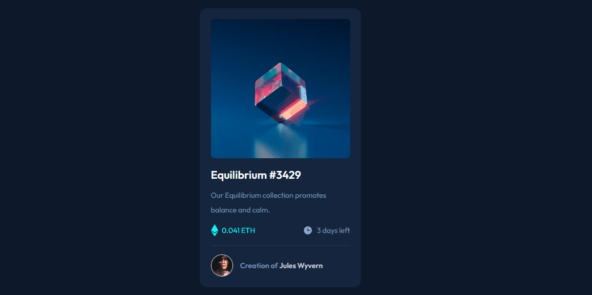

# Frontend Mentor - NFT preview card component solution

Esta é uma solução do  [NFT preview card component challenge on Frontend Mentor](https://www.frontendmentor.io/challenges/nft-preview-card-component-SbdUL_w0U). 

## Indice

- [Overview](#overview)
  - [O Desafio](#o-desafio)
  - [Screenshot](#screenshot)
  - [Links](#links)
- [Meu processo](#meu-processo)
  - [Feito com](#feito-com)
  - [O que aprendi](#o-que-aprendi)
- [Autor](#author)

## Overview

### O Desafio

Usuários devem ser capazer de ver:

- O design responsivo 
- Os Estados de hover

### Screenshot

### Links

- [Código no github](https://your-solution-url.com)
- [Site no ar](https://your-live-site-url.com)

## Meu processo

### Feito com

- Semantic HTML5 markup
- CSS custom properties
- Flexbox
- Mobile-first workflow
- Css in Modules
- Sass
- [React](https://reactjs.org/)

### O que aprendi

Este projeto é muito interessante para praticar os fundamentos do css como posicionamento com flex e grid, e varias estilizações. É muito bom para testar algum recurso novo pois seu nível de dificuldade é mais simples.

## Author

- [Portfolio](rialbeg.github.io/portfolio)
- Frontend Mentor - [@rialbeg](https://www.frontendmentor.io/profile/rialbeg)